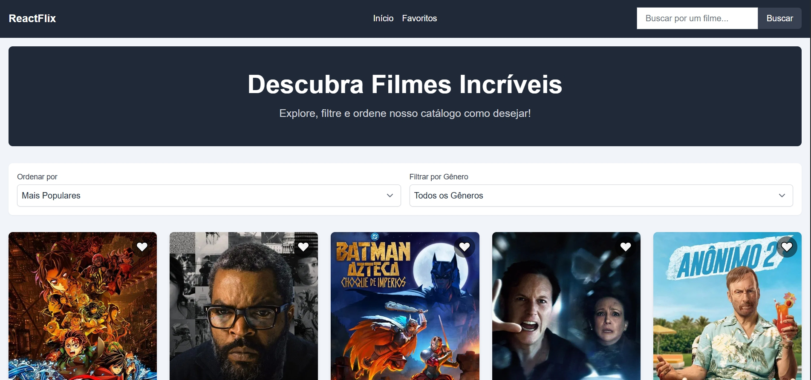

# 🎬 ReactFlix: Catálogo de Filmes



## 📝 Descrição do Projeto

**ReactFlix** é uma aplicação web de catálogo de filmes desenvolvida como parte de um projeto intensivo de 15 dias para aprimorar e re-solidificar minhas habilidades com **React**. A aplicação consome a API do [The Movie Database (TMDB)](https://www.themoviedb.org/documentation/api) para fornecer uma experiência rica e interativa para o usuário explorar, buscar e favoritar filmes.

Este projeto foi construído com foco em boas práticas, componentização, gerenciamento de estado e design responsivo.

### 🔗 Demo ao Vivo

**Acesse a aplicação em funcionamento aqui:** [https://reactflix-delta.vercel.app/]

---

## ✨ Funcionalidades Principais

- **Página Inicial Dinâmica:** Exibe filmes com filtros de gênero e opções de ordenação (popularidade, data de lançamento, etc.).
- **Busca em Tempo Real:** Permite aos usuários pesquisar filmes por título.
- **Página de Detalhes:** Mostra informações completas de cada filme, incluindo sinopse, nota, gêneros e trailer.
- **Sistema de Favoritos:** O usuário pode adicionar e remover filmes de uma lista de favoritos, que persiste entre sessões (usando `localStorage`).
- **Paginação:** Navegação por páginas nos resultados da Home e da Busca.
- **Modal de Trailer:** Visualização do trailer do filme diretamente na página de detalhes.
- **Design Responsivo:** Interface totalmente adaptável para dispositivos móveis, tablets e desktops.
- **Feedback de UI:** Indicadores de carregamento (spinners) e tratamento de erros para uma melhor experiência do usuário.

---

## 🛠️ Tecnologias Utilizadas

O projeto foi construído utilizando as seguintes tecnologias e ferramentas:

- **Framework Principal:** [React](https://reactjs.org/)
- **Build Tool:** [Vite](https://vitejs.dev/) - Para um ambiente de desenvolvimento rápido e moderno.
- **Linguagem:** [TypeScript](https://www.typescriptlang.org/) - Para um código mais seguro e manutenível.
- **Estilização:** [Tailwind CSS](https://tailwindcss.com/) - Para uma estilização rápida e responsiva baseada em classes utilitárias.
- **Roteamento:** [React Router DOM](https://reactrouter.com/) - Para a navegação entre páginas.
- **Gerenciamento de Estado Global:** [React Context API](https://reactjs.org/docs/context.html) - Para o sistema de favoritos.
- **Cliente HTTP:** [Axios](https://axios-http.com/) - Para realizar as chamadas à API do TMDB.
- **Deploy:** [Vercel](https://vercel.com/) - Para a hospedagem e deploy contínuo.

---

## 🚀 Como Executar o Projeto Localmente

Siga os passos abaixo para rodar o ReactFlix na sua máquina.

### Pré-requisitos

Você vai precisar ter o [Node.js](https://nodejs.org/en/) (versão LTS recomendada) e o [npm](https://www.npmjs.com/) ou [yarn](https://yarnpkg.com/) instalados.

### Passos

1.  **Clone o repositório:**

    ```bash
    git clone https://github.com/GustavoWillian7/Reactflix
    ```

2.  **Navegue até a pasta do projeto:**

    ```bash
    cd reactflix
    ```

3.  **Instale as dependências:**

    ```bash
    npm install
    ```

4.  **Configure as variáveis de ambiente:**

    - Crie um arquivo chamado `.env.local` na raiz do projeto.
    - Você precisará de uma chave de API do [The Movie Database (TMDB)](https://www.themoviedb.org/documentation/api). É gratuito e rápido de obter.
    - Adicione a seguinte linha ao seu arquivo `.env.local`:
      ```
      VITE_TMDB_API_KEY="SUA_CHAVE_DA_API_AQUI"
      ```

5.  **Inicie o servidor de desenvolvimento:**

    ```bash
    npm run dev
    ```

    A aplicação estará disponível em `http://localhost:5173` (ou outra porta indicada no terminal).

---

## 👨‍💻 Autor

Desenvolvido por **[Gustavo Willian]**.

- **LinkedIn:** [https://www.linkedin.com/in/gustavo-willian-867605230/]
- **GitHub:** [https://github.com/GustavoWillian7]
